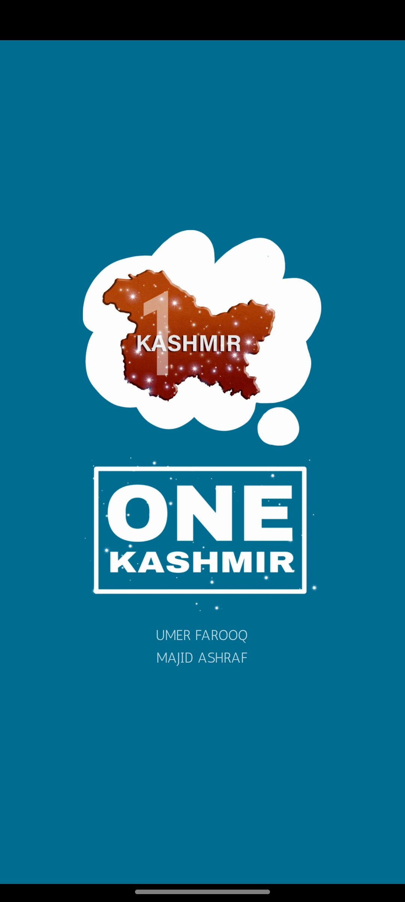
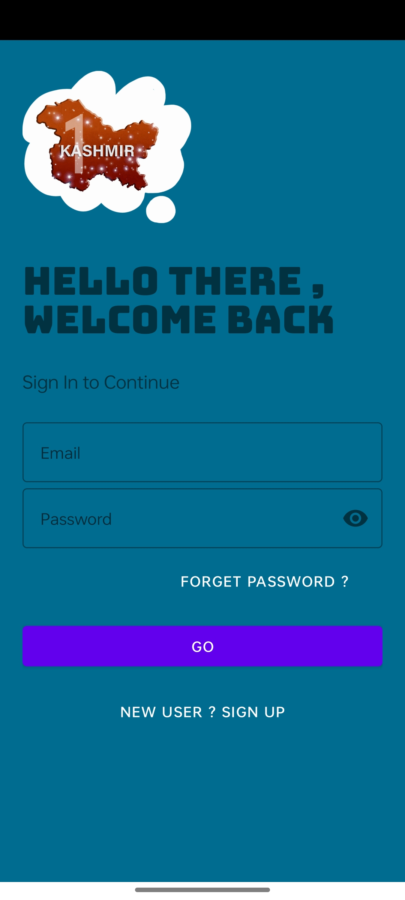
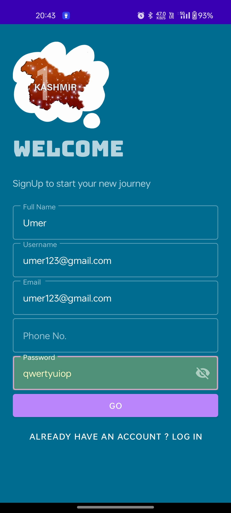
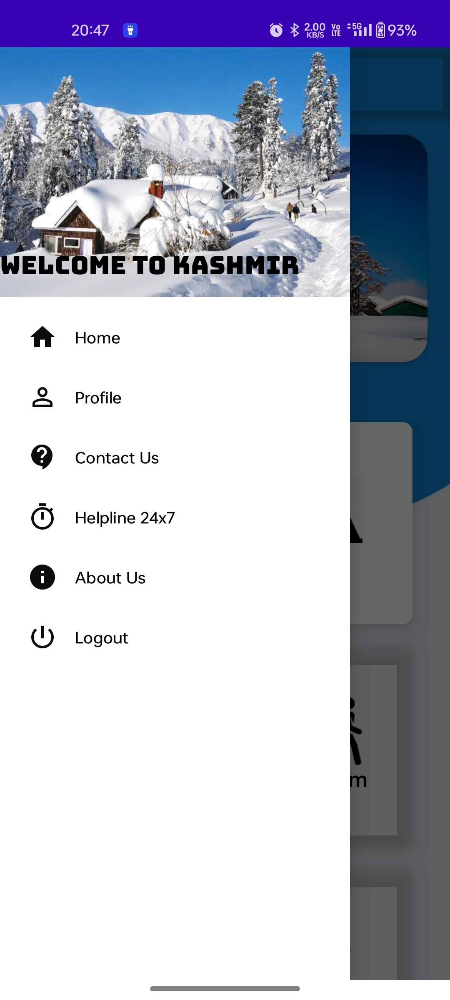
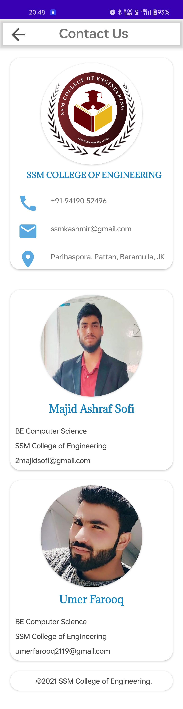
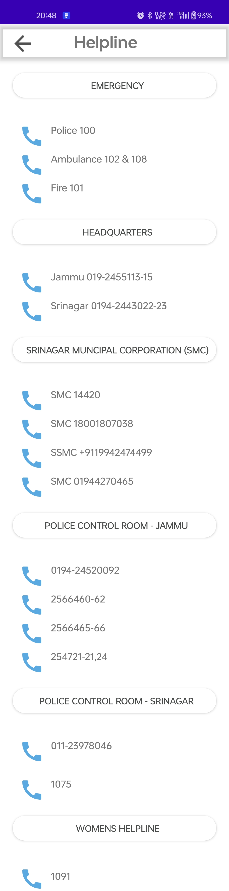

# 🌄 ONE KASHMIR

ONE KASHMIR is an integrated Android application designed to unify multiple state departments — PDD, PHE, PWD, Tourism, and Disaster Management — into a single platform for efficient governance and citizen services. Developed using Java and XML in Android Studio (Gradle), this app provides seamless access to various departmental functionalities, making administration and public access simpler and faster.

---

## 🚀 Features
- *Multi-Department Integration*  

- *PDD (Power Development Department)*  
  - Track complaints, report outages, view dashboards.
   
- *PHE (Public Health Engineering)*  
  - Water supply issues, new connections, complaints, dashboards.
    
- *PWD (Public Works Department)*  
  - Road complaints, project updates, dashboards.
 
- *Tourism & Disaster Management*  
  - Tourist destinations, alerts, disaster notifications, dashboards. 

 ---

##  User-Friendly Interface

- *Interactive Android UI using XML layouts.*
- *Responsive dashboards and department-specific screens.*   
- *Modular design for easier maintenance and updates.*

---

##  Security & Data Handling

- *Each module handles sensitive state-level data securely.*
- *Local and remote data management integrated using Gradle dependencies.*   

---

---
##  🖼 Example Screenshots
|  Splash Screen  | Login Screen  | SignUp  |
|----------------|----------------|----------------|
|  |  |  |
|  MenuBar  | User Profile  | Contact  |
| |  | |
| Helpline | User Profile  | About  |
|  |  |  |

---

## 📂 Project Structure
├── encryption.py # Main encryption and decryption implementation
├── utils/ # Helper functions (chaotic maps, DNA/RNA rules, scrambling, etc.)
├── README.md # Project documentation

---

---

## 👨‍🎓 STUDENT

**Umer Farooq**
Roll Number: **03MTGC23**
Department of Computer Science & Engineering
**Government College of Engineering and Technology (GCET), Jammu**
M.Tech (4th Sem) (Computer Science and Engineering)
