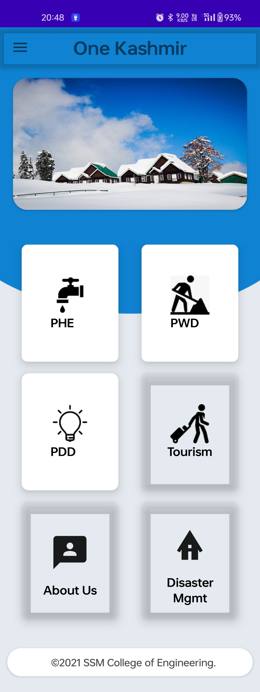
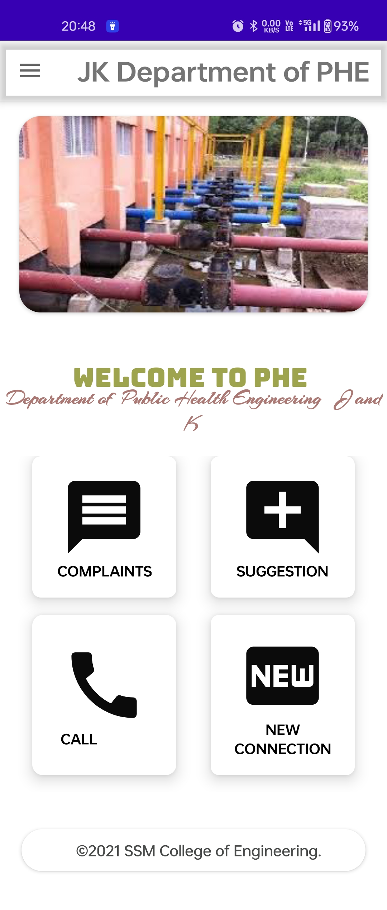
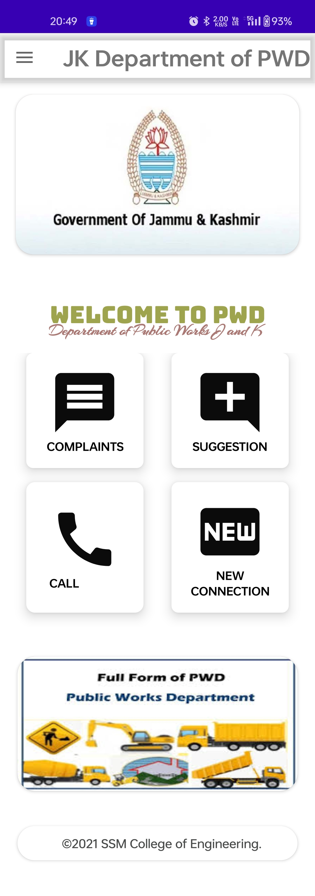
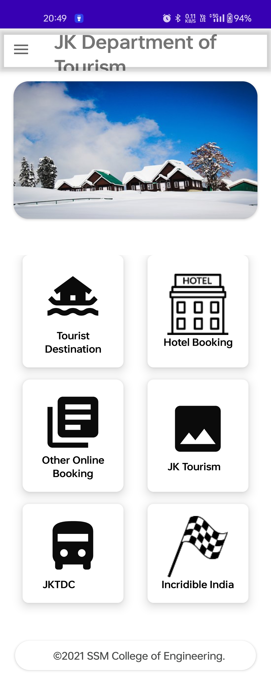
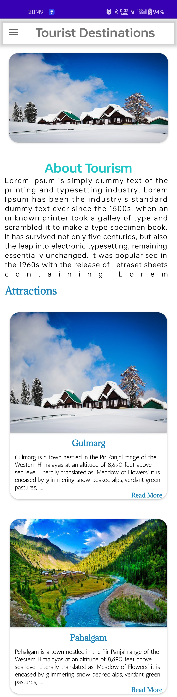
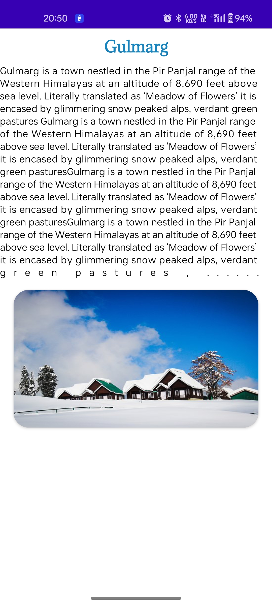

# 🌄 ONE KASHMIR

ONE KASHMIR is an integrated Android application designed to unify multiple state departments — PDD, PHE, PWD, Tourism, and Disaster Management — into a single platform for efficient governance and citizen services. Developed using Java and XML in Android Studio (Gradle), this app provides seamless access to various departmental functionalities, making administration and public access simpler and faster.

---

## 🚀 Features
- *Multi-Department Integration*  

- *PDD (Power Development Department)*  
  - Track complaints, report outages, view dashboards.
   
- *PHE (Public Health Engineering)*  
  - Water supply issues, new connections, complaints, dashboards.
    
- *PWD (Public Works Department)*  
  - Road complaints, project updates, dashboards.
 
- *Tourism & Disaster Management*  
  - Tourist destinations, alerts, disaster notifications, dashboards. 

 ---


##  User-Friendly Interface

- *Interactive Android UI using XML layouts.*
- *Responsive dashboards and department-specific screens.*   
- *Modular design for easier maintenance and updates.*

---

##  Security & Data Handling

- *Each module handles sensitive state-level data securely.*
- *Local and remote data management integrated using Gradle dependencies.*   

---
## 📦 Dependencies
- *Android SDK*
- *Gradle*
- *Google Services*
- *Backend Firebase*
- *JDK*
---

## 💡 How to Run

1. Clone the repository:
   - git clone https://github.com/umer2119/one-kashmir.git
2. Open in Android Studio.
3. Sync Gradle and build the project.
4. Run on an emulator or connected device.
   
---
##  🖼 Example Screenshots
|  Splash Screen  | Login Screen  | SignUp  |
|----------------|----------------|----------------|
|  |  |  |
|  MenuBar  | User Profile  | Contact  |
| |  | |
| Helpline | Dashboard  | About  |
|  |  |  |
| PHE Department | PWD Department  | Tourism  |
|  |  |  |
| Tourist Destination | Gulmarg  | Hotels  |
|  |  |  |

---
## 👨‍🎓 STUDENT
**Umer Farooq**
M.Tech  (Computer Science and Engineering)

---

## 📂 Project Structure
```text
ONE_KASHMIR/
├── app/
│   ├── src/
│   │   ├── main/
│   │   │   ├── java/com/example/bull_project/  # All Java classes
│   │   │   ├── res/                            # XML layouts, drawables, mipmaps
│   │   │   ├── AndroidManifest.xml
│   │   └── test/                               # Unit tests
├── build.gradle
├── gradle.properties
├── settings.gradle
├── README.md


